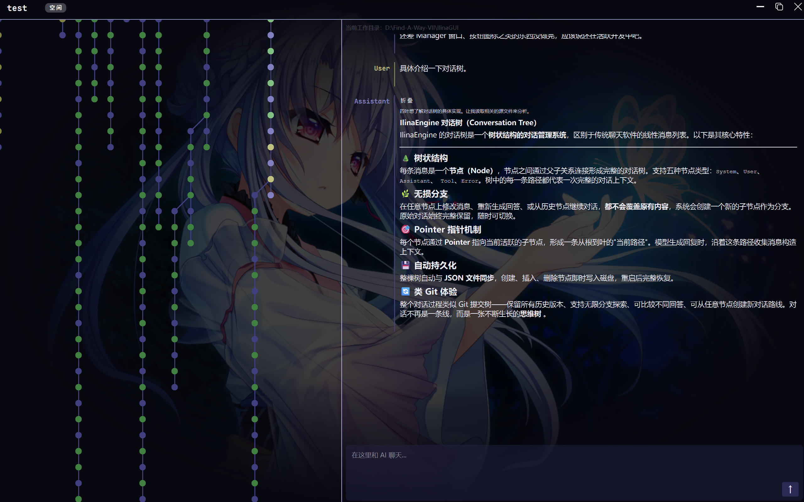
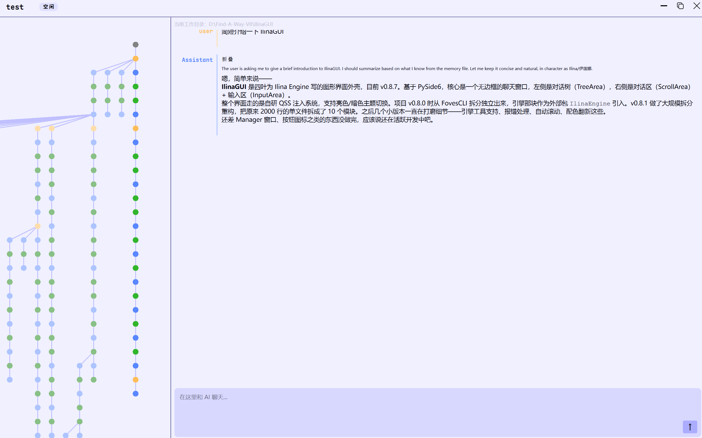
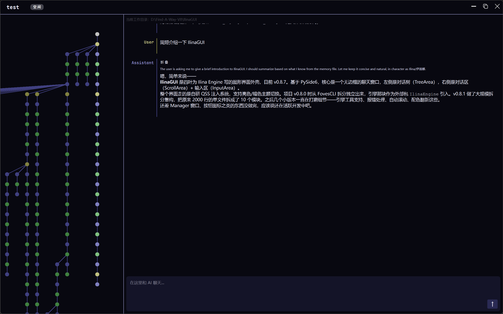

# IlinaGUI
IlinaGUI 是一个面向长期项目和复杂思考过程的 AI 客户端。

```
思维永远不应该只是一条线，而Ilina会为你记录每一个如果
```

与传统线性聊天不同，
Ilina 使用树状结构保存整个思考过程，
允许你从任何历史节点重新开始，
而不会丢失原有上下文。

当然，你也可以看看 [Ilina Engine](https://github.com/Foves7017/IlinaEngine) ，然后自己操刀创建一个专属于你的 Ilina 客户端

# 核心特点
## 完美兼容 Ilina Engine 特有的对话树结构
对话树是 Ilina Engine 完全不同于其他 AI 客户端的核心特性。你可以从任何地方重新开始对话，以及随时查看过去的对话。

```
思维永远不应该只是一条线，而Ilina会为你记录每一个如果
```
## 可完全自定义的亮色/暗色主题
除了初始设定的颜色，你还可以很轻松地改变 Ilina GUI 的颜色。只需要打开 QSS 文件夹，即可在 yaml 文件中改变颜色或在 QSS 文件中设置样式。


当然，你也可以自定义背景图 XD

## 丰富的自带工具和 MCP 调用
作为一个助手，IlinaEngine 自带了例如文件读写等一系列便利的工具，同时你还可以自由配置自己需要的 MCP 来扩展 Ilina 的能力。

Ilina GUI 兼容 MCP 官方 SDK 配置格式。
绝大部分可运行于 Claude Code、
Cursor、Cherry Studio 等客户端的 MCP 服务，
都可以直接在 IlinaGUI 中使用。

## Workspace 工作区机制
每个对话树都拥有独立工作目录。

Ilina 默认只能访问当前工作区中的文件，
不会意外读取其它项目内容。

你还可以进一步配置 ignores，
禁止 Ilina 访问特定文件或文件夹。

# 如何安装和使用
## a.安装发布版
1. 下载 Release
2. 解压到你喜欢的地方
3. 【可选】推荐添加右键菜单，请见：[设置右键菜单](#在右键菜单中添加-在此处新建-ilina-对话树)
4. 设置 API 供应商，请见：[设置 API 服务商和 MCP](#如何设置-api-服务商和-mcp)
## b.从源码运行
1. 克隆本仓库到你喜欢的位置
2. 【可选】创建一个Python虚拟环境
3. `pip install -r requirements.txt`
4. `python main_gui.py`
## 如何使用
Ilina GUI 使用 `.ilinatree` 格式的文件保存对话树，你只需要创建一个空文件，然后用 Ilina GUI 打开即可。
你也可以传入一个文件夹，Ilina GUI 会自动创建 `.ilinatree` 文件。
不过我最推荐的做法还是先将“在此处新建 Ilina 对话树”添加到右键菜单，然后你就可以在你喜欢地方通过右键菜单新建对话了 : )

# 如何设置工作目录配置
首先，在你存放 `.ilinatree` 的文件夹创建一个 `.ilinaconfig` 文件，然后复制以下内容：
```JSON
{
  "workpath": "D:\\Find-A-Way-VII\\IlinaGUI",
  "open_or_alarm": true,
  "ignores": []
}
```
`workpath` 可以指定一个目录，作为 Ilina 的工作目录，默认是 `.ilinatree` 所在的目录。
`open_or_alarm` 可以指定 Ilina 的默认行为，为 true 时默认编辑后打开文件，为 false 时默认编辑后发送通知。
`ignores` 可以指定屏蔽的文件或文件夹，Ilina 无法访问屏蔽的文件或文件夹。

# 如何设置 API 服务商和 MCP 
首先需要打开你本地的 IlinaGUI 的目录，找到 `configs/engine.json`，打开。
```JSON
{
  "main_model": {
    "base_url": "https://api.deepseek.com",
    "api_key": "sk-xxxx",
    "model_name": "deepseek-v4-pro"
  },
  "sub_model": {
    "base_url": "http://localhost:11434/v1/",
    "api_key": "sk-xxx",
    "model_name": "qwen3-vl:4b"
  },
  "mcps": {
    "office-word": {
      "command": "path\\to\\mcp\\.venv\\Scripts\\python.exe",
      "args": [
        "path\\to\\mcp\\main.py"
      ]
    }
  },
  "default_system_prompt_template": "D:\\Find-A-Way-VII\\IlinaGUI\\configs\\default_system.md",
  "global_ignores": [
    ".venv",
    "*.ilinatree",
    ".git",
    ".obsidian"
  ],
  "toast_icon_abs_path": null
}
```
按上例配置 main_model 和 mcp 即可，mcp 的配置就如同在 Claude Code 里一样。
另外，这里的 global_ignores 是全局的屏蔽，作用和工作区屏蔽相同，但对所有工作区默认生效

# 在右键菜单中添加 “在此处新建 Ilina 对话树”
可以参考如下的注册表并手动添加：
```
Windows Registry Editor Version 5.00

[HKEY_CLASSES_ROOT\Directory\Background\shell\IlinaGUI]
@="在此处新建Ilina对话树"
"Icon"="path\\to\\IlinaGUI\\images\\ico.ico"

[HKEY_CLASSES_ROOT\Directory\Background\shell\IlinaGUI\command]
@="\"path\\to\\IlinaGUI\\IlinaGUI.exe\" \"%V\""
```

# 未来计划
- [ ] 更好的 Markdown 渲染
- [ ] 可以直接转为文件的 markdown 文本块
- [ ] mermaid、latex 渲染
- [ ] 各种按钮的图标
- [ ] Manager 窗口

# 更新日志
## v0.8.7
 - 优化了自动滚动
 - 重新整理了亮色和暗色的配色

## v0.8.6 
 - 针对引擎的报错和警告进行了处理

## v0.8.5
 - 紧急修复了FastMCP的横幅问题 : )

## v0.8.2
 - 增加了对 IlinaEngine 内部工具的支持